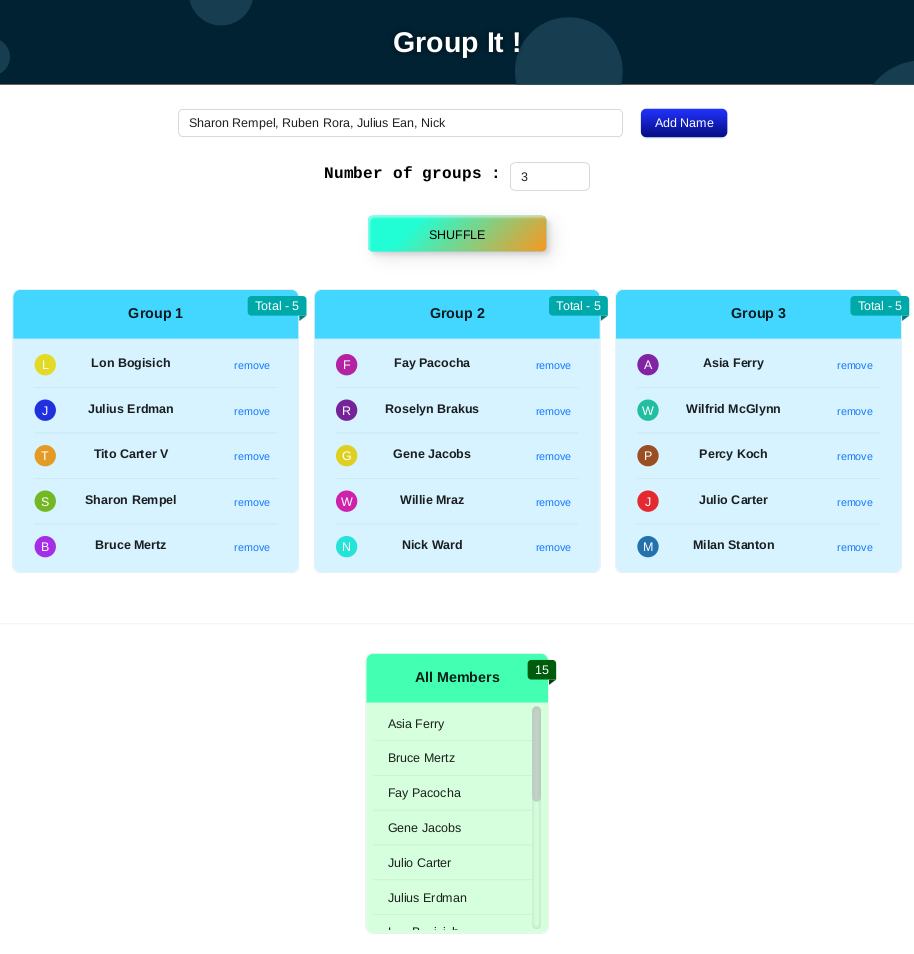

# _Group It_ ! 
### About
This App takes input of names, ✨ Shuffle ✨ and divide them into n number of group.
It is useful when you want to play games with large team and require them to divide in group.

> You can add multiple name separated by , (comma). i.e. _Alice, Jim_

#JustForFun

# Getting Started with Create React App

This project was bootstrapped with [Create React App](https://github.com/facebook/create-react-app).
It uses redux-toolkit to manage state
## Available Scripts

In the project directory, you can run:

### `npm start`

Runs the app in the development mode.\
Open [http://localhost:3000](http://localhost:3000) to view it in your browser.